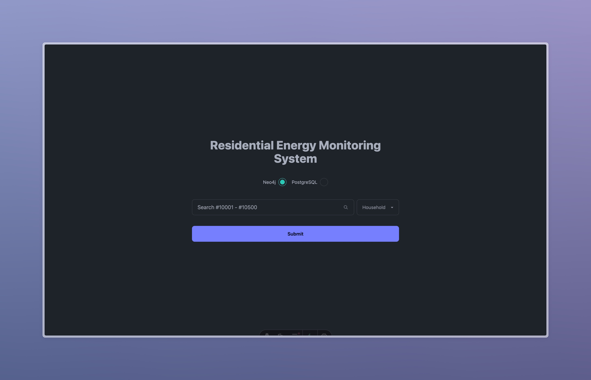
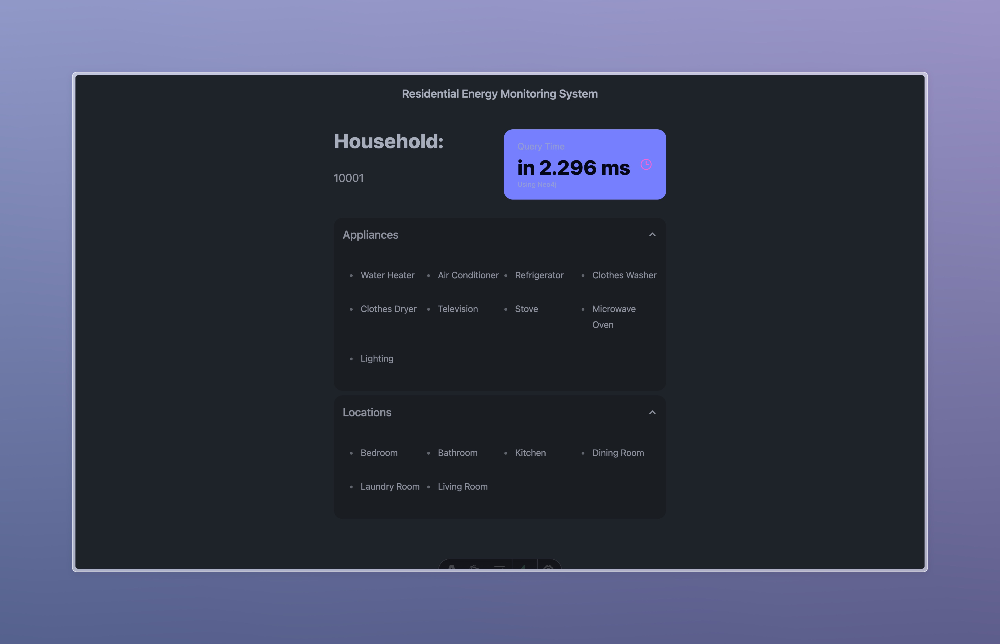

# Residential Energy Monitoring System

A simple website that enables users to search for households, appliances, locations and energies, replicating actual energy monitoring systems for residential areas.

## Features

- Search for households, appliances, locations and energies
- Switch between Neo4j and PostgreSQL

## Screenshots

### Home Page



### Search Page



## Tech Stack

**Frontend:** Astro, TailwindCSS, DaisyUI, AlpineJS

**Backend:** Neo4j, Supabase

## Environment Variables

To run this project, you will need to add the following environment variables to your .env file:

### Neo4j

- `NEO4J_URI`
- `NEO4J_USERNAME`
- `NEO4J_PASSWORD`

### Supabase

- `SUPABASE_URL`
- `SUPABASE_KEY`

## Run Locally

Clone the project:

```bash
  git clone https://github.com/ezzylan/residential-energy-monitoring-system
```

Go to the project directory:

```bash
  cd residential-energy-monitoring-system
```

Install dependencies:

```bash
  bun install
```

Start the server:

```bash
  bun dev
```

## Contributing

Contributions are always welcome!

See `contributing.md` for ways to get started.

Please adhere to this project's `code of conduct`.

## License

[MIT](https://choosealicense.com/licenses/mit/)
